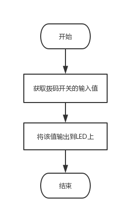
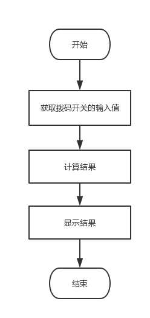
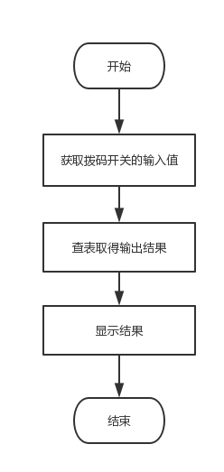
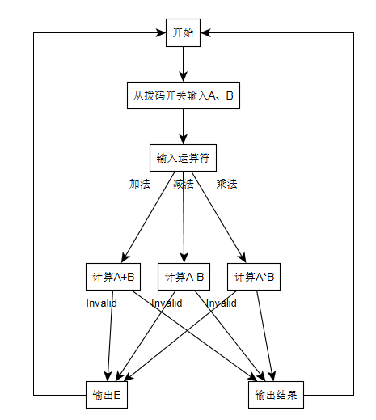
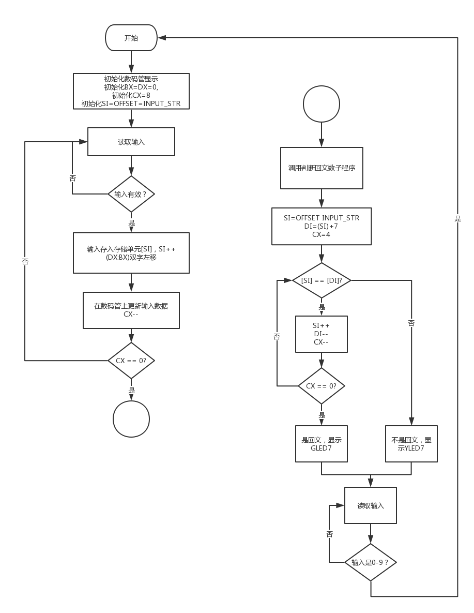
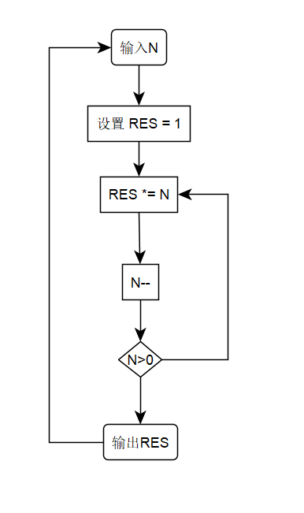
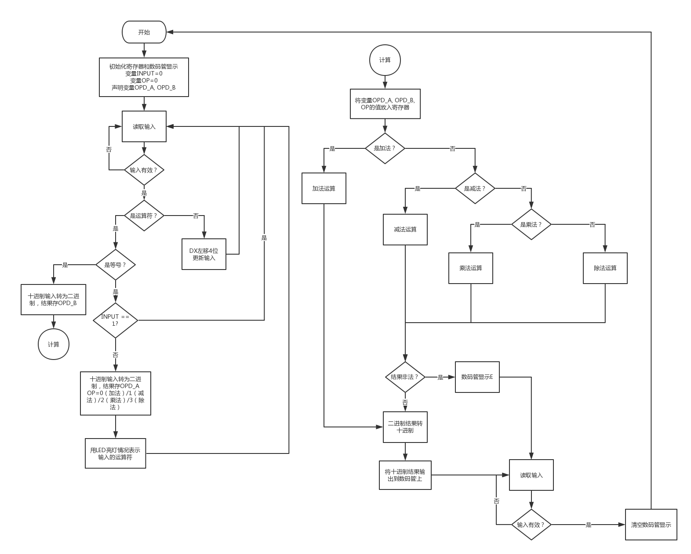
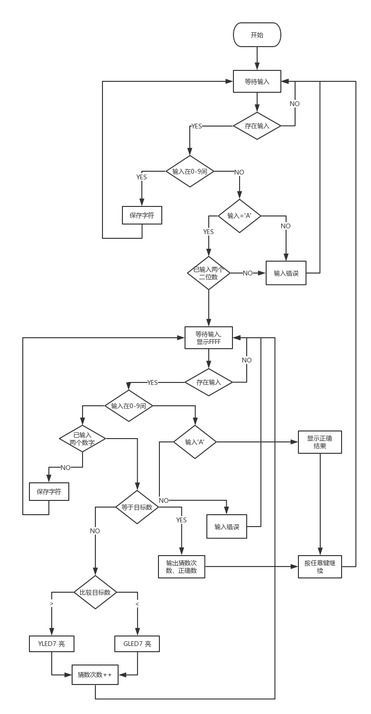

# 实验4.2.1  读取拨码开关的数据输出到LED

## 一、实验目的

## 二、实验内容

### 1）实验题目

​	利用程序模版完善带???的程序段实现以下功能：从拨码开关（SW15~SW0）读取数据输出到 		LED（YLED7\~YLED0，GLED7\~GLED0）上。

```assembly
CODE SEGMENT 
	ASSUME CS:CODE 
START:
	???
	JMP START 
CODE ENDS 
	END START
```

### 2）算法流程图



### 3） 程序清单

```assembly
CODE SEGMENT 'CODE'   ; the start of code segment
    ASSUME CS:CODE ; initialize CS register
START:
    MOV AH, 0H  ; get the switch's value
    INT 31H     ; get the switch's value
    INT 30H     ; display on leds
    JMP START
CODE ENDS   ; the end of code segment
    END START
```

### 4） 结果照片


## 三、实验体会

这个实验助教带我们熟悉了Minisys系统，我们学会了如何用i8086 IDE生成比特流文件并将程序下载进实验板中运行，整体进行顺利。

# 实验4.2.2 两数相加

## 一、实验目的

1)     进一步熟悉 S86_SimpleSys 汇编程序设计、编译、链接、下载执行的方法。

2)     学会数码管的输出

3)     练习加法指令，熟悉顺序程序设计

## 二、实验内容

### 1）实验题目

利用程序模版完善带???的程序段实现以下功能：从拨码开关输入两个8 位二进制数（A、B），将这两个数的和以16进制数形式输出到数码管上。A等于SW15\~SW8的值；B等于SW7~SW0的值。

```assembly
CODE SEGMENT 
	ASSUME CS:CODE 
START:
	??? 
   JMP START 
CODE ENDS 
END START 
```

### 2）算法流程图



### 3） 程序清单

```assembly
CODE SEGMENT 'CODE'
    ASSUME CS:CODE
START:
    MOV AH, 0
    INT 31H     ; read input
    MOV CH, DH  ; copy DH to CH
    ADD DL, DH  ; add two 8-bit digits
    ADC DH, 0   ; add carry to DH
    SUB DH, CH  ; figure out whether there's a carry
    MOV AL, 1FH
    MOV AH, 00H
    INT 32H
    INC AH
    INT 32H     ; display sum
    JMP START
CODE ENDS
    END START

```

### 4） 结果照片


## 三、实验体会

我们用了一种巧妙的方法来实现两个8位数带进位的加法，这样写程序指令数可能会少一些。

# 实验4.2.3 查表求平方并以十六进制输出

## 一、实验目的

1) 熟悉查表（换码）指令的用法

## 二、实验内容

### 1）实验题目

利用程序模版完善带???的程序段实现以下功能：在内存中从 Table 开始的 10 个单元中连续存放 0 到 9 的平方值，从拨码开关中以二进制形式输入一个 0 到 9 的数 X，查表求 X的平方值，以 16 进制形式输出到数码管上。

```assembly
DATA SEGMENT 
    TABLE DB ??? 
DATA ENDS 
CODE SEGMENT  
   ASSUME CS:CODE, DS: DATA 
START: 
	MOV AX, 0080H  ;数据段从内存的0080段开始 
 	MOV DS, AX    
 	??? 
 	JMP START 
CODE ENDS 
   END START 
```

### 2）算法流程图



### 3） 程序清单

```assembly
DATA SEGMENT 'DATA'
    TABLE DB 0, 1, 4, 9, 16, 25, 36, 49, 64, 81
DATA ENDS

CODE SEGMENT 'CODE'
    ASSUME DS:DATA, CS:CODE
START:
    MOV AX, 0080H   ; DATA segment starts from 0080H
    MOV DS, AX  ; reset DS register
    INT 31H     ; read input into DX
    MOV BX, OFFSET TABLE    ; set base address
    MOV AL, DL              ; set offset
    XLAT    ; look up for the table
    MOV DL, AL
    MOV AL, 03H
    INT 32H     ; AH=00H
    INC AH
    INT 32H     ; display
    JMP START
CODE ENDS
    END START
```

### 4） 结果照片


## 三、实验体会

对于有数据段的程序，一定要初始化DS。实验手册上明确实验板的数据段从0080H开始，不能遗漏。同时，这次实验也让我们熟悉了XLAT查表指令的使用。

# 实验4.3.3 两个数的加减乘

## 一、实验目的

1) 进一步加强分支程序和循环程序设计。

2) 学会带有菜单功能的程序设计。

3) 巩固加法、减法和乘法运算程序的设计。

## 二、实验内容

### 1）实验题目

从拨码开关输入两个 8 位二进制数（A、B），通过 4×4 键盘分别输入 1（加法）、2（减法）或 3（乘法）对这两个数进行运算，将计算结果以 10 进制的形式输出到数码管（A3~A0）上。A 等于 SW15~SW8 的值；B 等于 SW7~SW0 的值。（注意：如果减法计算结果为负数或者计算结果大于
9999 则显示E）。程序循环往复。 

### 2）算法流程图



### 3） 程序清单

```assembly
DATA SEGMENT 'DATA'
    DIVIDER DW 10
DATA ENDS


CODE SEGMENT 'CODE'
    ASSUME CS:CODE, DS:DATA
START:      MOV AX, 0080H
            MOV DS, AX
            XOR AX, AX
            MOV AL,0FH      ; Serica: 设置数码管d3~d0允许显示
            INT 32H         ; Serica: 设置数码管d3~d0允许显示
            XOR AL,AL       ; Serica: AL清零
            INT 31H         ; SAVE (A,B)->(DH,DL)
INPUT:      XOR AH, AH
            INT 33H         ; READ THE CURRENT INPUT AND SAVE TO AL
            ;JNC EXCEPTION
            CMP AL, 10011B       ; IF AL==10011B, MULTIPLICATION  (CF=0,ZF=0)
            JZ MULTIPLICATION
            CMP AL, 10010B
            JZ SUBTRACTION
            CMP AL, 10001B
            JZ ADDITION
            JMP START ; Serica: 除了上面三种情况，其余输入都是非法的，直接返回START
ADDITION:   MOV CL, DH ; STORE THE VALUE OF NUMBER A INTO CL
            AND DX, 0FFH ; 
            ADD DX, CX      ; SAVE THE RESULT TO DX STILL
            CMP DX, 10000   ; Serica: COMPARE THE RESULT WITH 10000
            JNC EEE   ; CF=0, => (DX)>=10000(>9999) => DISPLAY E
            JMP OUTPUT
SUBTRACTION:    MOV CL, DH
                AND DX, 0FFH
                AND CX, 0FFH
                SUB CX, DX
                MOV DX, CX
                JC EEE
                JMP OUTPUT
MULTIPLICATION: MOV AL, DH
                MUL DL
                CMP AX, 10000   ; COMPARE AX AND 10000. IF AX > 9999(CF=0), JUMP TO EEE
                JNC EEE
                MOV DX, AX
                JMP OUTPUT
EEE:        MOV DX, 0EEEEH
            MOV AH, 1   
            INT 32H     
            JMP START
EXCEPTION:  MOV DX, 0FFFFH
            MOV AH, 0
            INT 30H         ; PRINT FFFF, INDICATING AN END
            JMP INPUT       ; JUMP TO INPUT AGAIN

OUTPUT: 
        MOV AX, DX           
        MOV CL, 0           ; THE NUMER TO ROTATE
        MOV BX, 0           ; SET BX TO 0. THE FINAL ANS IS SAVED TO BX
        MOV SI, 10          ; SI SHOULD ONLY BE SET ONCE DURING THE LOOP. OTHERWISE IT'S A WASTE OF TIME
TRANS:  XOR DX, DX
        DIV SI              ; AX STORES THE RESULT WHILE DX STORES THE REMAINDERH. NOTE THAT THE RESULT HAS AT MOST 10
        SAL DX, CL          ; SHIFT DX TO THE LEFT 0/4/8/12BITS
        OR  BX, DX          ; SAVE THE RESULT TO [BX]
        ADD CL, 4           ; NEXT TIME, SHIFT 4BITS MORE
        CMP AX, 0      ; TEST IF THERE ARE NO RESULTS
        JNZ TRANS           ; IF THE RESULT IS 0, THEN LOOP ENDS
        ; MOV DX, 123H
        MOV AH, 1
        MOV DX, BX
        INT 32H
        JMP START
CODE ENDS
    END START
```

### 4） 结果照片

从拨码开关输入操作数A为3，B为1。

- 加法


- 减法


- 乘法


- 减法溢出


- 乘法溢出


## 三、实验体会

这个实验实现的实际上是一个简单的计算器。需要处理的地方主要在于十进制输入输出转化以及异常处理，如果写成子程序的形式会便于之后的实验使用。

# 实验4.4.1 判断回文

## 一、实验目的

1) 熟悉子程序的编写。

2) 进一步熟悉分支程序、循环程序的编写。

## 二、实验内容

### 1）实验题目

从 4×4 键盘上输入由 8 个 0~9 的数字组成的字符串，在数码管上回显，并编写子程序判断该字符串是否为回文，如果是回文则 GLD7 亮，否则 RLD7 亮，按 0~9 任意一键进入下一轮查询。所谓回文字符串是指一个字符串正读和倒读都是一样的，例如字符串‘ABCDEFFEDCBA’就是一个回文字符串，而字符串‘ABCFDDCAB’就不是回文字符串。 

### 2）算法流程图



### 3） 程序清单

```assembly
DATA SEGMENT 'DATA'
    INPUT_STR DB 8 DUP(?)
DATA ENDS

CODE SEGMENT 'CODE'
    ASSUME DS:DATA, CS:CODE
START:
INIT_DISPLAY:
    MOV AX, 0080H
    MOV DS, AX
    MOV AL, 0FFH
    XOR AH, AH
    INT 32H
INIT_REGS:
    LEA SI, INPUT_STR
    XOR BX, BX      
    XOR DX, DX      ; DX:BX STORES THE DISPLAY DATA
    MOV CX, 8       ; USE CX AS LOOP COUNTER
LOOP_READ_INPUT:
    XOR AH, AH
    INT 33H         ; AL STORES THE INPUT
    TEST AL, 10H
    JZ LOOP_READ_INPUT   ; IF THERE IS NO INPUT, THEN KEEP READING
    AND AL, 0FH     ; ELSE, CLEAR STATUS BIT
    MOV [SI], AL    ; SAVE DATA TO MEM
    INC SI
PREPARE_DISPLAY_DATA:
    PUSH CX         ; SAVE LOOP COUNT
    MOV CL, 4       ; SHIFT LEFT DX:BX
    SHL DX, CL
    MOV CH, BH
    SHL BX, CL
    SHR CH, CL
    OR DL, CH
    OR BL, AL       ; SAVE NEW INPUT TO (DX:BX)[3:0]
DISPLAY_INPUT:
    MOV AH, 2
    INT 32H ; DISPLAY A7~A4
    XCHG DX, BX
    DEC AH
    INT 32H ; DISPLAY A3~A0
    XCHG DX, BX
LOOP_CONTROL:
    POP CX
    LOOP LOOP_READ_INPUT    ; END OF LOOP
JUDGE_PALINDROME:
    CALL IS_PALINDROME
OUTPUT_RESULT:
    XOR AH, AH  ; SHOW RESULT ON LED
    INT 30H     ; SHOW RESULT ON LED
    JMP START


IS_PALINDROME PROC
IS_PALINDROME_LOOP_INIT:
    MOV CX, 4
    LEA SI, INPUT_STR   ; SI POINTS TO THE HEAD OF INPUT_STR
    MOV DI, SI  
    ADD DI, 7           ; DI POINTS TO THE TAIL OF INPUT_STR
IS_PALINDROME_LOOP_BODY:
    MOV AL, BYTE PTR[SI]
    CMP AL, BYTE PTR[DI]
    JNZ IS_PALINDROME_FALSE
    INC SI
    DEC DI
    LOOP IS_PALINDROME_LOOP_BODY
IS_PALINDROME_TRUE:
    MOV DX, 0080H   ; IS PALINDROME, LIT GLED7
    RET
IS_PALINDROME_FALSE:
    MOV DX, 8000H   ; IS NOT PALINDROME, LIT YLED7
    RET
IS_PALINDROME ENDP
CODE ENDS
    END START
```

### 4） 结果照片

- 输入回文字符串，绿灯亮


- 输入非回文字符串，黄灯亮


## 三、实验体会

这次实验进一步帮助我们熟悉汇编语言的编程，用到了一些诸如双字左移、存储器存取的技巧，采用了循环以及分支的程序设计。当然，判断回文这里用的是按字符逐个比较，也可以考虑用串操作代替逐个字符的处理。

# 实验4.4.2 利用递归程序，计算N!

## 一、实验目的

1）巩固子程序设计以及参数传递。 

2）学会递归程序设计。 

## 二、实验内容

### 1）实验题目

用4×4 键盘每次输入一个数 N(1~6 之间)，则上利用一个递归过程 FAC 来计算 N!，然后将计算的结果以 10 进制的形式输出到数码管上。

### 2）算法流程图



### 3） 程序清单

```assembly
CODE SEGMENT 'CODE'
    ASSUME CS:CODE
START:
INPUT:  MOV AH, 0
        INT 33H
        CMP AL, 10001B  ;IF AL < 10001, CF = 1
        JC INPUT
        CMP AL, 10111B  ;IF INPUT >= 7, CF= 0
        JNC INPUT
        AND AL, 0FH
        MOV CX, AX
        MOV AX, 1
        ;MOV DX, 1       ; THE RESULT WOULD BE SAVED DIRECTLY TO DX
FAC:    
        MUL CX
        LOOP FAC
        MOV SI, 10
        MOV CL, 0
        MOV BX, 0
OUTPUT: XOR DX, DX
        DIV SI
        SAL DX, CL
        OR BX, DX
        ADD CL, 4
        TEST AX, 0FFFFH
        JNZ OUTPUT
        MOV AL, 0FH
        MOV AH, 0
        INT 32H     ; ENABLE A[3:0] 
        MOV AH, 1
        MOV DX, BX
        INT 32H     ; SHOW THE RESULT
        JMP START
CODE ENDS
    END START
```

### 4） 结果照片

- 1！


- 2！


- 3！


- 4！


- 5！


- 6！


## 三、实验体会

这次实验同样是运用循环的方法计算

# 实验4.5.1 四则运算计算器

## 一、实验目的

综合上面实验的训练结果，进一步加强汇编编程能力。

## 二、实验内容

### 1）实验题目

编写汇编程序完成简单的四则运算计算器功能：

**运算规则如下：**

a）加法：加数和被加数最多4位，仅GLED0亮表示加法。

b）减法：减数和被减数最多4位，不考虑结果为负，仅GLED1亮表示减法。

c）乘法：乘数和被乘数最多4位，仅GLED2亮表示乘法。

d）除法：除数和被除数最多4位，结果低四位输出商、高四位输出余数，仅GLED3 亮表示除法。

e）不考虑连续运算。

f）运算错误，含减法结果为负，最左数码管A0显示为‘E’。

**输入输出规则：**

a）输入的操作数为4位，多于4位则整体左移，丢弃最先输入的，新输入的放在A0，A3~A0依次对应千、百、十、个位。

b）当按下操作符后，开始输入第二个操作数，且第一个数为被减数、被除数、被乘数或者被加数。

c）按下“＝”号，才会输出计算结果，此时再按下任意键启动下一轮的计算

### 2）算法流程图



### 3） 程序清单

```assembly
DATA SEGMENT
    OPD_DEC DW ?
    OPD_BIN DW ?
    OPD_A DW ?
    OPD_B DW ?
    INPUT DW 0
    OP DB 0
    TEN DW 10
DATA ENDS

CODE SEGMENT 'CODE'
    ASSUME CS: CODE, DS: DATA
START:
INIT:
    ; INIT DS
    MOV AX, 0080H
    MOV DS, AX
    MOV INPUT, 0
    ; ENABLE A[7..0]
    XOR AH, AH
    MOV AL, 0FFH
    INT 32H
WAIT_INPUT:
    XOR DX, DX
    MOV CL, 4
WAIT_INPUT_LOOP:
    ; READ INPUT
    XOR AH, AH
    INT 33H
    ; TEST WHEATHER INPUT IS VALID
    TEST AL, 10H
    ; IF NOT VALID, KEEP WAITING
    JZ WAIT_INPUT_LOOP
    ; ELSE CLEAR STATUS BIT
    AND AL, 0FH
    ; IF (AL)>=OA, IT IS AN OPERATOR
    CMP AL, 0AH
    JNC INPUT_OP    
    ; ELSE IT IS A DIGIT
    SHL DX, CL
    OR DL, AL
    ; DISPLAY NEW INPUT
    MOV AH, 1
    INT 32H
    JMP WAIT_INPUT_LOOP
INPUT_OP:
    ; IF OPERATOR IS ' ', DO NOTHING
    CMP AL, 0EH
    JZ WAIT_INPUT
    ; ELSE IF OPERATOR IS '=', CACULATE AND DISPLAY RESULT
    CMP AL, 0FH
    JZ INPUT_EQ

    ; IF INPUT = 1, DO NOTHING AND WAIT '='
    CMP INPUT, 1
    JNZ WAIT_INPUT_LOOP
    
    ; ELSE, STORE THE FIRST OPD IN OPD_A AND SAVE OP
    INC INPUT
    MOV OPD_DEC, DX
    CALL DEC_TO_BIN
    PUSH OPD_BIN
    POP OPD_A   ; SAVE OPD_A
    ; DEBUG
    ; PUSH AX
    ; MOV AH, 2
    ; MOV DX, OPD_A
    ; INT 32H
    ; POP AX
    ; SAVE OP
    SUB AL, 0AH
    MOV OP, AL
    ; DISPLAY OP ON LED
    PUSH CX
    PUSH DX ; SAVE SCENE
    MOV DX, 0001H
    MOV CL, AL
    SHL DX, CL
    XOR AH, AH
    INT 30H
    POP DX  ; RETRIEVE SCENE
    POP CX
    
    JMP WAIT_INPUT
INPUT_EQ:
    ; SAVE OPD_B
    MOV OPD_DEC, DX
    CALL DEC_TO_BIN
    PUSH OPD_BIN
    POP OPD_B
    
    ; CALCULATE AND DISPLAY
    CALL CALCULATE
   
    JMP START

CALCULATE PROC
    MOV AX, OPD_A
    MOV BX, OPD_B
    MOV CL, OP
    XOR DX, DX
    CMP CL, 00H
    JZ IS_ADD
    CMP CL, 01H
    JZ IS_SUB
    CMP CL, 02H
    JZ IS_MUL
    CMP CL, 03H
    JZ IS_DIV
IS_ADD:     
    ADD AX, BX
    ADC DX, 0
    JMP R_OUT       ; REGULAR OUTPUT
IS_SUB:     
    SUB AX, BX
    JC E_OUT
    JMP R_OUT
IS_MUL:     
    MUL BX
    CMP DX, 1
    JNC E_OUT       ; IF DX>=1, THEN THE ANSWER IS INVALID AND JMP TO E_OUT
    JMP R_OUT
IS_DIV:    
    CMP BX, 0   ; BX SHOULD NOT BE ZERO
    JZ E_OUT
    XOR DX, DX      ; SERICA: SET DX TO ZERO
    DIV BX          ; DX(remainder), AX(result)<-(DX:AX)/(BX)
    JMP DIV_OUT
E_OUT:      
    MOV DX, 0E000H   ; SHOW E ON THE LEFTMOST DIGIT
    MOV AH, 2
    INT 32H         ; OUTPUT E
    XOR DX, DX
    MOV AH, 1
    INT 32H
    JMP WAIT_IN
R_OUT:
    CALL BIN_TO_DEC
DISPLAY: 
    ; DX STORES THE HIGH DIGITS WHILE BX STORES THE LOW DIGITS
    MOV AH, 2

    INT 32H ; SHOW THE HIGH DIGITS' INPUT
    MOV DX, BX

    MOV AH, 1
    INT 32H
    JMP WAIT_IN
DIV_OUT:         ]
    MOV DI,DX
    XOR DX, DX
    CALL BIN_TO_DEC
    MOV AX,DI
    XOR DX, DX
    MOV DI,BX
    CALL BIN_TO_DEC
    MOV DX,BX
    MOV BX,DI
    JMP DISPLAY
WAIT_IN:    
    XOR AH, AH
    INT 33H
    TEST AL, 10H     
    JZ WAIT_IN
    XOR DX, DX
    INT 30H
    MOV AH, 1
    INT 32H
    MOV AH, 2
    INT 32H
    RET
CALCULATE ENDP

DEC_TO_BIN PROC
; PARAM OPD_DEC:
; RETURN OPD_BIN:
    ; SAVE SCENE
    PUSH AX
    PUSH CX
    ; INIT
    XOR AX, AX  ; AX STORES THE RESULT
    MOV CL, 12  ; USE CL AS LOOP COUNTER
DEC_TO_BIN_LOOP:
    MOV DI, 000FH ; USE DI AS MASK
    SHL DI, CL      ; ADJUST MASK ACCORDING TO CL
    MOV DX, OPD_DEC
    AND DX, DI
    SHR DX, CL
    MOV SI, DX  ; 
    MUL TEN     ; (AX) *= 10, MIND IT WILL ALTER DX TOO
    ADD AX, SI  ; (AX) += CURRENT DIGIT
    SUB CL, 4
    CMP CL, 0
    JGE DEC_TO_BIN_LOOP
    MOV OPD_BIN, AX

    ; RETRIEVE SCENE
    POP CX
    POP AX
    RET
DEC_TO_BIN ENDP

BIN_TO_DEC PROC
; PARAM DX:AX:  BIN
; RETURN DX:BX: DEC
    XOR BX, BX
    XOR SI, SI
    MOV CX, 4
BIN_TO_DEC_LOOP:
    PUSH CX
    MOV CX, SI
    DIV TEN     ; DX(remainder), AX(result)<-(DX:AX)/10 
    SHL DX, CL
    ADD SI, 4
    OR BX, DX
    XOR DX, DX  ; DO NOT FORGET CLEAR DX
    POP CX
    CMP AX, 0
    JNZ BIN_TO_DEC_LOOP
    DIV TEN
    RET
BIN_TO_DEC ENDP

CODE ENDS
END START
```

### 4） 结果照片

- 加法（9999+9998）：


- 减法（3-2）：


- 除法（10/3）：


- 乘法（3*2）：


- 异常（3-4）：


## 三、实验体会

这次实验综合运用了我们所学的汇编知识，程序流程较为复杂，设计了多个子程序负责不同的任务，如二进制和十进制之间的转换等等。在编程时，要考虑许多运行细节，如各个寄存器的状态和职责，且如果子程序要用到寄存器，一定要注意先保护现场，执行后要恢复。这个实验中子程序还用到了存储器操作数传参的方式。由于程序较为复杂，因此设计时先画好流程图显得尤其重要。另外，因为是汇编，且要烧入电路才能看运行效果，调试起来比较麻烦。遇到问题时，我们人为加了一些代码，使寄存器变量打印在数码管上，以此作为“断点”，这种方式帮助我们解决了程序中出现的错误。

# 实验4.5.2 猜数游戏

## 一、实验目的

综合以上实验的训练结果，进一步汇编编程能力。 

## 二、实验内容

### 1）实验题目

首先通过键盘输入两个数字组成一个十进制两位数（00\~99），按下 A 键隐藏该数，然后开始猜数游戏，由键盘输入一个猜测的数，如大于隐藏的数 YLED7 亮，小于则 GLED7 亮，此时可继续输入猜测的数直到猜对为止。猜对后，高 4 位数码管（A7\~A4）显示猜对的数，低 4 位数码管（A3\~A0）该显示猜对所用的次数。 

规则如下： 

1）输入状态时，输入的结果数必须小于 3 位，即小于 100，多于 2 位则整体左移，丢弃最先输入的，新输入的放在 A4，A5\~A4 依次对应十、个位。 

2）输入状态时，A3\~A0 为 FFFF 

3）输入状态时，输入‘A’后进入猜数状态，此时数码管 A7\~A4 为 FFFF 隐藏结果数。 

4）猜数状态时，每输入 2 个数字当做一次有效的猜数，并且猜数次数增加一次。 

5）猜数状态时，A5\~A4 显示猜的数，A3\~A0 显示猜的次数。 

6）猜数状态时，当所猜数大于隐藏数则 YLED7 亮，小于则 GLED7 亮，猜中则 LED 全灭。 

7）猜数状态时，输入‘A’直接在 A5\~A4 上显示出结果数，输入 0\~A 任意键启动下一次猜数游戏,进入输入状态。 

8）猜数状态时，猜中时输入 0\~A 任意键启动下一次猜数游戏，进入输入状态。 

### 2）算法流程图



### 3） 程序清单

```assembly
CODE SEGMENT 'CODE'
    ASSUME CS:CODE
START:  
INPUT_SESS: XOR DX, DX   ; SERICA: CLEAR LEDS
            INT 30H
            MOV AL, 0FFH     ; SET AL TO 1111 1111 B
            XOR AH, AH      ; SET AH=0
            INT 32H         ; ENABLE A[7:0]
            MOV DX, 0
            MOV AH, 2
            INT 32H
            MOV DX, 0FFFFH  
            MOV AH, 1       
            INT 32H         ; SET A[3:0] TO FFFF
            XOR DX, DX      ; THE RESULT WOULD BE SAVED TO DX(DL), AND IT IS INITIALIED INTO 00H
            MOV CL, 4
SAVE_RES:   XOR AH, AH
            INT 33H         ; SAVE INPUT TO AL. THE REAL INPUT IS AL[3..0]
            CMP AL, 10H     ; COMPARE AL WITH 0. IF CF=1, THEN INPUT IS INVALID
            JC SAVE_RES
            CMP AL, 1AH     ; COMPARE AL WITH A. IF ZF=1, JUMP TO GUESS. ELSE IF CF = 0, INPUT IS INVALID.
            JZ GUESS_SESS
            JNC SAVE_RES
            SHL DL, CL      ; ROTATE CH TO ITS LEFT BY FOUR BITS
            AND AL, 0FH     ; DELETE A[4]
            OR DL, AL       ; SAVE THE NEWLY INPUT DIGIT TO DL
            MOV AH, 2
            INT 32H         ; SHOW THE NEWLY INPUT DIGIT.
            JMP SAVE_RES

GUESS_SESS: MOV BX, DX      ; REMOVE THE RESULT FROM REGISTER DX TO REGISTER BX(BL)
            AND BX, 0FFH     ; SERICA: ONLY A5~A4 IS VALID INPUT
            MOV DX, 0FFFFH  ; SET A[7:4] TO FFFF
            MOV AH, 2
            INT 32H         ; HIDE THE TRUE RESULT AND SHOW FFFF INSTEAD ON A[7:4]
        

; DOES ANY MORE OPERATION NEED OT BE INSERTED?
; CAN WE USE SI TO SAVE THE NUMBER OF TRIALS?
            XOR SI, SI      ; SI STORES NUM TRAILED, INIT ONCE
            
G_INPUT_S:  MOV CX, 2
            XOR DX, DX
G_INPUT:    
            XOR AH, AH
            INT 33H         ; READ FROM KEYBOARD, STORE IN AL
            CMP AL, 10H     ; COMPARE AL WITH 0. IF CF=1, THEN INPUT IS INVALID AND WE DO NOT SHOW IT
            JC G_INPUT
            CMP AL, 1AH     ; COMPARE AL WITH A. IF CF=0, INPUT IS INVALID AND WE DO NOT SHOW IT
            JZ SHOW_RES
            JNC G_INPUT
            AND AL, 0FH     ; IF INPUT IS VALID, THEN
            PUSH CX
            MOV CL, 4
          
            SHL DL, CL
            POP CX
            OR DL, AL       ; SAVE DIGIT
            LOOP G_INPUT
            INC SI
            PUSH DX
            MOV DX, SI
            MOV AH, 1
            INT 32H         ; SET A[3:0] TO THE NUMBER OF TRIALS TAKEN
            POP DX
            
            CMP DL, BL 
            JZ G_EQ         ; IF GUESS EQUALS TO THE TRUE RESULT
            JA G_GT         ; IF GUESS IS LESS THAN THE TRUE RESULT
G_LT:       MOV DX, 80H     ; GLED7=1
            XOR AH, AH
            INT 30H
            JMP G_INPUT_S
G_EQ:       XOR AH, AH
            XOR DX, DX      ; ALL LIGHTS ARE OFF
            INT 30H
            JMP NEXT_SESS
G_GT:       XOR AH, AH      
            MOV DX, 8000H   ; YLED7=1
            INT 30H
            JMP G_INPUT_S
SHOW_RES:   XOR DX, DX   ; SERICA: CLEAR LEDS
            INT 30H
            MOV DX, BX      ; SHOW THE TRUE RESULT IMMEDIATELLY AFTER PRESSING 'A'
            MOV AH, 2
            INT 32H         
            ; SERICA: NOT NECESSARY
            ; JMP NEXT_SESS   ; AND PRESS ANY BUTTON TO ENTER INPUT_SESS AGAIN
NEXT_SESS:  XOR AH, AH      ; ENTER A DIGIT 0~A AND ENTER THE NEXT INPUT SESSION
            INT 33H         ; ATTAIN THE RESULT AND SAVE TO AL
            CMP AL, 10H
            JC NEXT_SESS
            CMP AL, 1BH
            JNC NEXT_SESS
            JMP INPUT_SESS

CODE ENDS
    END START
```


### 4） 结果照片

- 初始界面：


- 输入答案（20）：


- 按A进入猜数状态：


- 输入小于20的数：


- 输入大于20的数：


- 输入20：


- 按任意键进入下一轮：


## 三、实验体会

本实验较为复杂，因此调试用了比较长的时间。但实际上实验中所用方法在之前的实验中几乎都曾经出现过，难度不大。